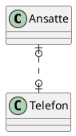
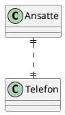
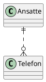
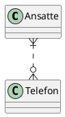

#Exercise 5
##A

### 1.

```plantuml
@startuml
Ansatte|o..o|Telefon
@enduml
```

### 2.

```plantuml
@startuml
Ansatte ||..|| Telefon
@enduml
```

### 3.

```plantuml
@startuml
Ansatte ||..o{ Telefon
@enduml
```

### 4.

```plantuml
@startuml
Ansatte ||..|{ Telefon
@enduml
```
### 5.

```plantuml
@startuml
Ansatte }|..o{ Telefon
@enduml
```

