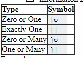
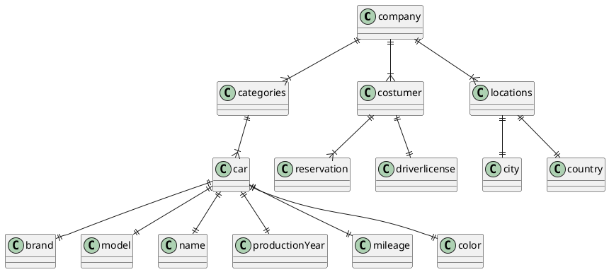

# NOUNS

car ,company ,brand ,model ,name ,production year,locations city country

```plantuml
@startuml
company ||--|{ categories
company ||--|{ costumer 

costumer ||--|{ reservation
costumer ||--|| driverlicense

categories ||--|{ car 

car ||--|| brand
car ||--|| model
car ||--|| name
car ||--|| productionYear
car ||--|| mileage
car ||--|| color

company ||--|{ locations
locations ||--|| city
locations ||--|| country
@enduml
```